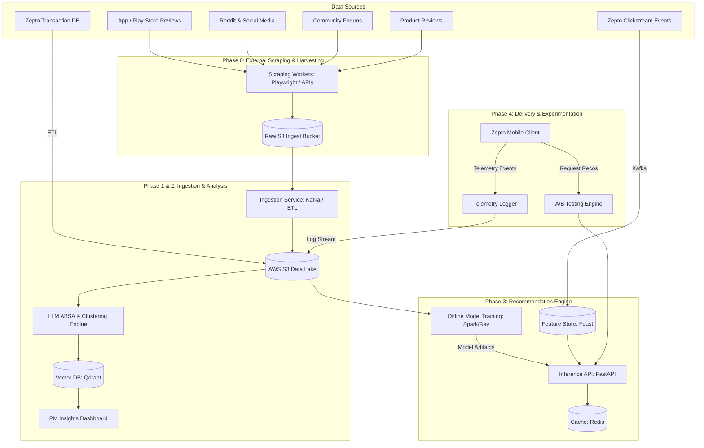
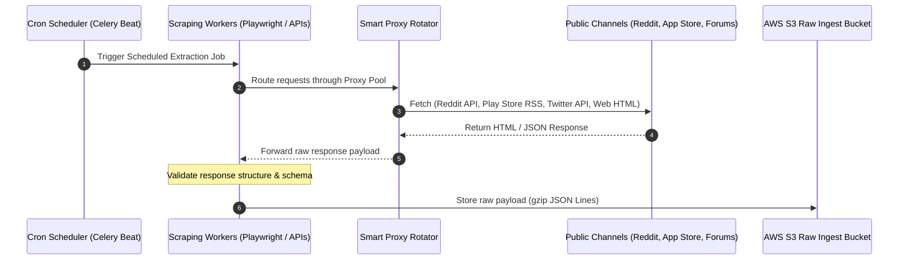
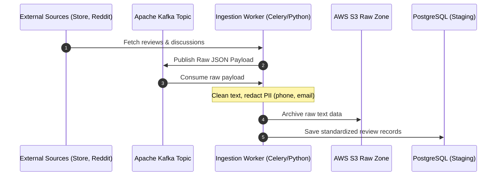
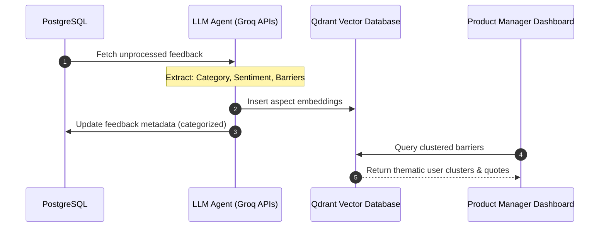
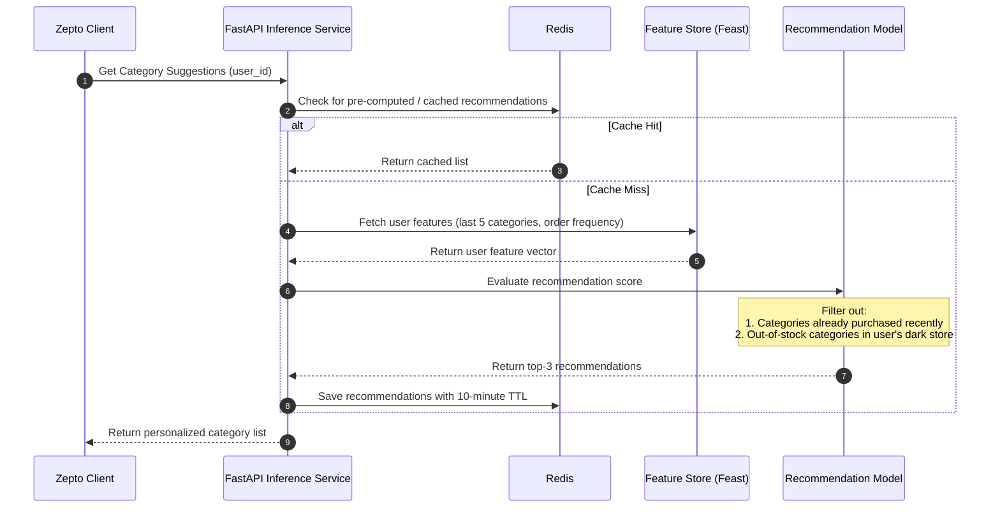
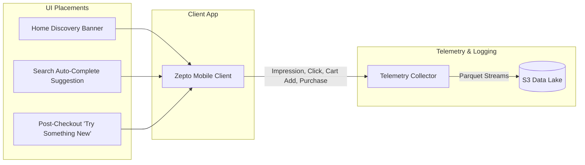

# AI-Powered Category Discovery Platform: Phase-Wise Technical Architecture

This document describes the end-to-end technical architecture for the AI-powered Product Discovery and Category Expansion platform for Zepto. The architecture is designed to scale to millions of Monthly Active Customers (MAC) while maintaining the sub-50ms response times required for quick-commerce applications.

---

## 1. System Architecture Overview

The system consists of three main pipelines:
1. **Feedback Ingestion & Qualitative Insights Pipeline (Asynchronous/Batch)**: Pulls unstructured reviews, runs LLM-based Aspect-Based Sentiment Analysis (ABSA), and identifies barriers to exploration.
2. **Behavioral Data & Feature Pipeline (Real-Time & Batch)**: Collects user clickstream events and transactions to update user profiles.
3. **Recommendation Inference Engine (Real-Time)**: Computes and serves personalized category suggestions.



---

## 2. Phase-Wise Architecture Roadmap

### Phase 0: External Data Harvesting & Scraping Engine
**Objective**: Build resilient, distributed extraction workers to scrape and gather unstructured customer feedback across multiple public review sites, social channels, and community forums.

> [!NOTE]
> For details on failure modes (anti-scraping, dynamic DOM parsing shifts, etc.), see [Phase 0 Edge Cases](file:///d:/NAYAN-Nextleap/NextLeap-Zepto/docs/Phase0_EdgeCases.md).



#### Key Architecture Components:
* **Target Scrapers & Adapters**:
  * **App Store & Play Store Scrapers**: Leverage Apple App Store RSS feeds and Google Play Store APIs (`google-play-scraper`) to pull reviews, user ratings, and app version context.
  * **Reddit Crawler**: Custom integration with the Reddit API (`PRAW`) targeting quick-commerce keywords (e.g., "Zepto", "Blinkit", "delivery charges", "rotten fruits") in community subreddits like `r/india` and `r/bangalore`.
  * **Social Media & Community Listeners**: Custom collectors subscribing to social listening webhooks or crawling public networks for brand mentions.
  * **Product Review Aggregators**: Distributed web scrapers utilizing **Playwright** and **BeautifulSoup4** to extract feedback and product reviews from e-commerce platforms and quick-commerce discussion forums.
* **Resiliency & Anti-Blocking Infrastructure**:
  * **Proxy Rotation Service**: Route scrapers through a smart rotating proxy provider (e.g., ScrapeOps / Crawlera) to manage IP bans, rate limits, and CAPTCHAs.
  * **Rate Limiting & Backoff**: Standardize scheduling to run in off-peak hours and enforce exponential backoff with jitter on request failures.
* **Raw Ingestion Storage**:
  * Scraped raw datasets are archived in `s3://zepto-analytics-data/raw/feedbacks/` partitioned by source and date.

---

### Phase 1: Foundation & Unified Data Ingestion
**Objective**: Build a robust, scalable ingestion pipeline to collect qualitative reviews and quantitative behavioral data, standardizing them into a structured schema.

> [!NOTE]
> For details on ingestion failure modes (PII leakage, Kafka lag handling, schema drifts), see [Phase 1 Edge Cases](file:///d:/NAYAN-Nextleap/NextLeap-Zepto/docs/Phase1_EdgeCases.md).

#### Subphases for Implementation:
* **Phase 1a: Raw Data Ingestion & Archival**: Implement an ingestion listener/worker to load raw scraped JSON Lines data, validate structures using Pydantic, and archive them in S3 raw directories.
* **Phase 1b: Local PII Redaction Pipeline**: Build a local Named Entity Recognition (NER) parser utilizing SpaCy and regex profiles to scrub phone numbers, emails, and address strings.
* **Phase 1c: Message Broker Ingestion**: Establish Apache Kafka topic flows (`topic-feedbacks`, `topic-clickstreams`) and build producers and consumers to decouple data ingestion from database updates.
* **Phase 1d: Relational Database Storage**: Setup relational database schemas in PostgreSQL tailored to `ReviewSchema` attributes. Utilize `JSONB` for unstructured `extra_metadata` fields, implement `ON CONFLICT (review_id) DO UPDATE` upserts for event deduplication, and define GIN indexes on metadata filters for analytical query performance.
* **Phase 1e: End-to-End Pipeline Orchestration**: Build a unified runner script (`run_pipeline.py`) that sequentially executes Phase 0 scrapers and triggers the raw validation, PII redaction, broker queueing, and staging database ingestion to verify complete pipeline connectivity.
* **Phase 1f: Continuous Scheduled Ingestion**: Configure a GitHub Actions workflow (`.github/workflows/scheduled_ingestion.yml`) running on a daily cron schedule (`0 0 * * *`) and on-demand triggers to run the end-to-end ingestion pipeline, keeping database statistics updated with the latest customer feedbacks.



#### Key Architecture Components:
* **Ingestion Worker**: Lightweight Python service utilizing `celery` for task scheduling and concurrency.
* **Message Broker**: **Apache Kafka** or **AWS Kinesis** for high-throughput messaging. All clickstream events and scraped reviews are routed through dedicated topics.
* **PII Redactor**: Custom regex and Named Entity Recognition (NER) models (using SpaCy) to scrub customer names, phone numbers, and delivery details from reviews before processing.
* **Storage Layer**:
  * **AWS S3**: Acts as the raw data lake archiving raw, unredacted, and unvalidated scrapings.
  * **PostgreSQL (Analytical & Staging Store)**:
    * **Table Schema (`feedbacks`)**:
      * `review_id` (VARCHAR(100), PRIMARY KEY): Standardized unique identifier.
      * `source` (VARCHAR(50), NOT NULL): e.g., `play_store`, `app_store`, `reddit`, `forum`.
      * `rating` (INTEGER, NULL): Star score (1-5), null for social channels.
      * `title` (VARCHAR(255), NULL): Review headline.
      * `content` (TEXT, NOT NULL): Clean, PII-redacted text body.
      * `timestamp` (TIMESTAMP WITH TIME ZONE, NOT NULL): Content creation time.
      * `version` (VARCHAR(50), NULL): App version string.
      * `extra_metadata` (JSONB, DEFAULT '{}'): Nested dictionary mapping source-specific context (e.g. `thumbsUpCount`, `subreddit`, `author`).
      * `ingested_at` (TIMESTAMP WITH TIME ZONE, DEFAULT CURRENT_TIMESTAMP).
    * **Partitioning Scheme**: Partitioned by LIST on `source` (to isolate high-volume app review data from lighter community forum streams).
    * **Indexing**: 
      * GIN Index on `extra_metadata` for quick lookup of nested fields (e.g., query by subreddit or author).
      * BTree Index on `(timestamp, source)` to speed up time-sliced dashboard charts.
    * **Upsert (Deduplication) Pattern**:
      ```sql
      INSERT INTO feedbacks (review_id, source, rating, title, content, timestamp, version, extra_metadata)
      VALUES (%s, %s, %s, %s, %s, %s, %s, %s)
      ON CONFLICT (review_id) 
      DO UPDATE SET 
        content = EXCLUDED.content, 
        rating = EXCLUDED.rating, 
        version = COALESCE(EXCLUDED.version, feedbacks.version),
        extra_metadata = feedbacks.extra_metadata || EXCLUDED.extra_metadata,
        ingested_at = CURRENT_TIMESTAMP;
      ```
    * **Batching & Chunking Strategy**:
      * **Write Chunking (Database Inserts)**:
        * *Qualitative Reviews (Low-to-Medium Volume)*: Consumer workers should buffer reviews and perform bulk inserts in chunks of **50–100 records** (or trigger a flush every **5 seconds** of inactivity) to balance write latency and database transaction load.
        * *Clickstream Events (High Volume)*: Consumer workers should buffer events and execute bulk inserts in larger chunks of **1,000–5,000 records** (or flush every **15 seconds**), using bulk copy utilities like Psycopg2's `execute_values()`.
      * **Text/NLP Chunking (Phase 2 LLM Alignment)**:
        * *No Text Chunking*: Reviews, Reddit posts, and forum comments should be parsed as **single complete units** (without recursive chunk splits). This preserves semantic links between feedback attributes (like rating and context), as individual customer feedbacks are generally short (under 500 words).

---

### Phase 2: Qualitative Insights & Validation Engine
**Objective**: Leverage LLMs and NLP to extract barriers (e.g., trust, price, selection) from unstructured feedback and present them as structured, actionable insights for Product Managers.

> [!NOTE]
> For details on processing failure modes (LLM hallucinations, sarcasm handling, cluster drift), see [Phase 2 Edge Cases](file:///d:/NAYAN-Nextleap/NextLeap-Zepto/docs/Phase2_EdgeCases.md).



#### Key Architecture Components:
* **LLM Aspect-Based Sentiment Analysis (ABSA) Pipeline**:
  * Extracts specific **aspects** (e.g., "freshness of tomatoes", "price of electronics").
  * Categorizes sentiments and tags specific **friction categories** (e.g., Quality Skeptics, Out of Stock, UI Confusion).
* **Vector Database & Hybrid Retrieval**:
  * **Embedding Model**: Generates and stores dense semantic embeddings using **`bge-small-en-v1.5`** (via local Hugging Face `sentence-transformers` execution) of customer feedback.
  * **Metadata-Filtered Hybrid Search**:
    * *Pre-filtering:* Filters query records by staging metadata columns (`source`, `rating`, `version`, `timestamp` range) directly in the database before computing distance metrics.
    * *Sparse Match (BM25):* Matches exact query keywords, specific brand names (e.g., "Epigamia"), locations ("Indiranagar"), or version codes.
    * *Dense Match (Cosine Similarity):* Calculates semantic similarity to capture conceptual issues (e.g., matching "slow delivery" to "rider delayed, took 40 mins").
    * *Rank Fusion:* Integrates both lists using Reciprocal Rank Fusion (RRF) with balanced weights ($\alpha = 0.6$ dense, $0.4$ sparse).
  * **Unsupervised Thematic Clustering**: Runs HDBSCAN over the 384-dimensional BGE embeddings to automatically cluster similar customer complaints into trending PM friction themes.
* **PM Validation Dashboard (Streamlit/React)**:
  * Allows Product Managers to visualize trending barriers.
  * Generates dynamic user research interview guides tailored to identified friction clusters.

---

### Phase 3: Personalized Recommendation Engine
**Objective**: Build a hybrid, real-time recommendation service that suggests adjacent categories based on user historical transactions, current shopping context, and feedback insights.

> [!NOTE]
> For details on machine learning constraints (cold start, inventory synchronization, fatigue management), see [Phase 3 Edge Cases](file:///d:/NAYAN-Nextleap/NextLeap-Zepto/docs/Phase3_EdgeCases.md).



#### Key Architecture Components:
* **Feature Store (Feast)**:
  * **Online Store (Redis)**: Stores low-latency features like `user_last_5_clicked_categories` and `user_active_basket_value`.
  * **Offline Store (Snowflake/Redshift)**: Stores historical transaction matrices for training.
* **Hybrid Recommendation Algorithm**:
  * **Collaborative Filtering**: Suggests categories commonly co-purchased by similar cohorts (using Matrix Factorization or ALS).
  * **Content-Based & Contextual Filtering**: Maps product catalog descriptions and category tags into a shared semantic space using **`bge-small-en-v1.5`** embeddings. Computes cosine similarity between items currently in the active basket and long-tail category profiles to suggest adjacent categories (e.g., mapping "Gluten-free Spaghetti" to "Gourmet Pasta Sauces").
  * **Qualitative Constraint Filter**: Boosts categories that had high friction in user reviews but have since been resolved (e.g., if a user complained about "fruit freshness" and our rating in their dark store has improved, nudge "Fresh Fruits" once quality is validated).
* **Inference API**: A **FastAPI** service running inside Docker containers on AWS ECS, ensuring sub-50ms processing.
* **Privacy & Fallback Constraints**:
  * If the system cannot resolve a personalized recommendation query with sufficient confidence (e.g., cold start user), it must fallback to a static list of top-performing generic categories.
  * **Strict PII URL Filtering:** The API must NEVER attach or return any URLs or links containing customer personal information (e.g., tracking URLs with user IDs, names, addresses, or phone numbers). If the system cannot determine the clean URL target, it must strip the URL field entirely.

---

### Phase 4: Client Integration & Experimentation
**Objective**: Integrate recommendation entry-points into the Zepto client app and set up a closed-loop analytics system to measure conversions and A/B test models.

> [!NOTE]
> For details on client integration failure modes (latency fallback, sample ratio mismatch, viewport validation), see [Phase 4 Edge Cases](file:///d:/NAYAN-Nextleap/NextLeap-Zepto/docs/Phase4_EdgeCases.md).



#### Key Architecture Components:
* **Client UI Integration**:
  * **Discovery Widgets**: React Native components dynamically populated by the Inference API response.
  * **Contextual Banners**: Placed on checkout or search screens.
* **A/B Testing Engine (Split.io / Custom)**:
  * Splits MAC into:
    * *Control Group*: Sees generic/popular category recommendations.
    * *Treatment Group A*: Sees behavior-based collaborative filtering suggestions.
    * *Treatment Group B*: Sees qualitative-weighted recommendations (addressing known barriers).
* **Telemetry Collector (Segment / Amplitude / Custom Kafka Endpoint)**:
  * Captures detailed user action loops: `Recommendation_Shown` -> `Category_Clicked` -> `Item_Added_To_Cart` -> `Purchase_Completed`.
  * Feeds data back into the raw storage layer to retrain recommendation models.

---

## 3. Technology Stack Summary

| Layer | Technology | Rationale |
| :--- | :--- | :--- |
| **Scraping & Ingestion** | Playwright, BeautifulSoup4, PRAW (Reddit API), google-play-scraper, Apache Kafka, Celery | Resilient multi-source scraping workers, rate-limited harvesting, and event-driven routing. |
| **Database & Storage** | AWS S3, PostgreSQL, Qdrant | Raw file storage, structured relational metadata, high-performance vector search. |
| **Model Training & Analytics** | Apache Spark, PyTorch, Scikit-learn, Ray | Scalable data processing, model training, distributed hyperparameter tuning. |
| **Vector Embeddings** | bge-small-en-v1.5 (Hugging Face / sentence-transformers) | High-accuracy, low-latency 384-dimensional dense vectors; runs locally with zero API cost and is optimal for distance-based clustering. |
| **LLM Orchestration** | Groq Cloud APIs (e.g., Llama 3 70B, Mixtral 8x7b) | High-speed, low-latency inference endpoints for aspect extraction and classification. |
| **Feature Store** | Feast, Redis | Ultra-low latency retrieval (<10ms) of online customer profiles. |
| **API Serving** | FastAPI, Gunicorn, Docker, AWS ECS | Asynchronous HTTP handling, isolated container deployment, autoscaling. |
| **Experimentation** | Statsmodels, Amplitude, Custom Event Analytics | High-confidence conversion rates calculations and statistical validation. |

---

## 4. Key Considerations: Scalability, Performance, & Security

### Low Latency Execution
To prevent adding latency to the main purchase flow, the system enforces:
* **Recommendation Pre-computation**: For highly habitual users, top recommendations are pre-computed offline nightly and cached in Redis.
* **Async Ingestions**: Qualitative scraping runs entirely out-of-band and never interacts with the real-time order-taking system.

### Privacy & Data Security
* **PII Scrubber**: Before any qualitative reviews are stored or processed by LLM APIs, a local NLP parser scrubs user identification info.
* **Role-Based Access Control (RBAC)**: Qualitative dashboards are isolated from transactional payment cards or user addresses.

### Dark-Store / Inventory Check
* Recommendations must check **real-time dark-store inventory**. If a recommended category is out of stock in the user's local micro-warehouse (dark store), the Inference API dynamically replaces it with the next best category to avoid user disappointment.
