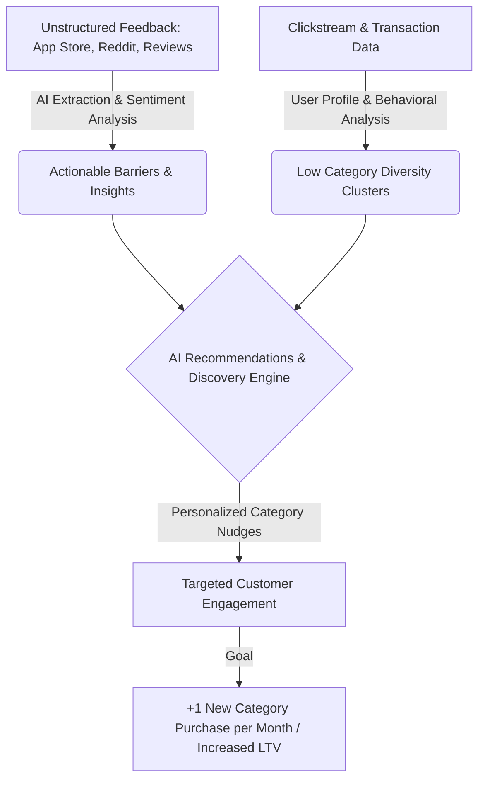

# Product Discovery & Category Expansion Engine for Quick-Commerce (Zepto)

## 1. Executive Summary
In the hyper-competitive quick-commerce landscape, retaining users and maximizing their lifetime value (LTV) is critical. While Zepto has achieved high purchase frequency and strong retention among its core customer base, a significant portion of Monthly Active Customers (MAC) exhibits a behavior of **category concentration**—primarily purchasing from a narrow subset of categories (e.g., Fresh Fruits & Vegetables, Milk & Dairy) while completely ignoring higher-margin or long-tail categories (e.g., Gourmet Foods, Personal Care, Electronics, Home Utility).

This document outlines the problem statement, objectives, target personas, and scope for building an **AI-powered discovery and personalization platform**. The platform's goal is to analyze customer feedback and shopping behavior, extract actionable product insights, and deliver hyper-personalized recommendations that nudge customers to purchase from at least one new product category every month.

---

## 2. Problem Statement & Opportunity
> **How might we build an AI-powered discovery application that analyzes customer feedback and shopping behavior to identify barriers to product exploration, generate actionable insights, and deliver personalized recommendations that encourage Monthly Active Customers to purchase from at least one new product category every month?**

### The Core Challenge
Quick-commerce users exhibit highly habitual buying behaviors. They open the app, search or navigate directly to their routine items, add to cart, and check out within minutes. While this high efficiency drives retention, it creates a massive barrier to **organic product discovery**. 
Furthermore, qualitative feedback regarding category barriers (e.g., "I don't trust quick-commerce for fresh meat," or "The search doesn't show relevant organic products") remains buried across thousands of unstructured reviews, app store feedback, and social media discussions.

### The Opportunity
By bridging the gap between **unstructured qualitative feedback** and **quantitative transactional data**, we can:
1. Identify and address friction points that prevent users from exploring specific categories.
2. Build a closed-loop recommendation engine that targets users with high purchase frequency but low category diversity, serving them highly contextual, low-friction entry points into new categories.

---

## 3. Key Objectives & Target Metrics
The success of the platform will be evaluated across two dimensions: qualitative insight generation and quantitative business impact.

### Objectives
* **Unified Feedback Aggregation**: Collect, ingest, and analyze customer feedback from multiple public and private sources (App Store/Play Store reviews, Reddit communities, social media conversations, product reviews, and quick-commerce discussion forums) using NLP and LLMs.
* **Friction & Barrier Identification**: Identify recurring themes, pain points, pricing issues, quality concerns, and trust barriers that prevent users from exploring specific categories.
* **Validation & Insights Loop**: Provide product managers with tools to validate AI-generated insights through structured user research/interviews.
* **Intelligent Recommendations**: Build and deploy an intelligent recommendation engine that predicts high-affinity "adjacent" categories for each user and delivers highly personalized suggestions without cluttering the checkout experience.

### Key Metrics (KPIs)
* **Primary Metric**: % of Monthly Active Customers (MAC) purchasing from a new category monthly.
* **Secondary Metrics**:
  * **Category Breadth per User**: Average number of unique categories purchased per user per month.
  * **Average Order Value (AOV)**: Increase in order value driven by cross-category additions.
  * **Click-Through Rate (CTR) & Conversion Rate (CVR)**: Interaction rates on personalized category recommendations.
  * **Feedback-to-Insight Cycle Time**: Time taken to detect a category barrier and propose product changes.

---

## 4. Target User Personas
To ensure high-impact recommendation targeting, we focus on three primary user cohorts:

| Persona | Characteristics | Behavior Pattern | Core Barrier |
| :--- | :--- | :--- | :--- |
| **Habitual Re-orderers** | • Weekly or daily ordering frequency. • Average order value is stable but low-margin. | • Directly navigates to "Order History" or searches for exact items. • Spends <2 minutes on the app per order. | Lack of awareness of other categories; high focus on speed. |
| **Skeptic Specialists** | • Uses Zepto *only* for specific items (e.g., soft drinks, snacks). • Uses competitors or offline stores for groceries, meat, or fresh vegetables. | • Cart consists strictly of packaged goods. • Abandons app if target brands are out of stock. | Trust and quality perception issues regarding fresh/unpackaged goods. |
| **Search-Driven Buyers** | • High search activity but low category traversal. • Leaves the app if the search term doesn't yield immediate matches. | • Relies heavily on search bar. • Avoids banner navigation and category pages. | Search discovery failure; relevant categories are not linked to search queries. |

---

## 5. Data Sources & Integration Scope
To build a comprehensive discovery engine, the system will integrate the following data flows:

### External (Qualitative Feedback)
* **App Store & Play Store Reviews**: Continuous streaming of user feedback, focusing on search usability, catalog complaints, and category experiences.
* **Reddit & Social Media discussions**: Scraping quick-commerce threads (e.g., r/india, r/bangalore) to monitor product conversations, unmet needs, and competitor gaps.
* **In-App Feedback & Surveys**: Feedback comments left post-delivery or after cart abandonment.

### Internal (Quantitative Behavior)
* **Clickstream Data**: Category browsing history, search query logs, banner clicks, and items added but subsequently removed.
* **Transaction History**: Historic orders, purchase frequency, category affinity, basket composition, and time-of-day buying patterns.

---

## 6. Project Scope
### In-Scope
* Development of an automated data crawler and NLP ingestion pipeline for external reviews and social discussions.
* LLM-driven aspect-based sentiment analysis and categorization of feedback to identify category-specific barriers.
* An interactive dashboard for Product Managers to review qualitative insights and generate user interview templates.
* A machine learning recommendation engine designed to suggest adjacent/complementary categories.
* Mobile UI mockups/components demonstrating recommendation placements (e.g., dynamic home widgets, smart search nudges, post-checkout discovery).

### Out-of-Scope
* Complete overhaul of the Zepto inventory/supply chain management system.
* Real-time delivery fleet tracking or warehouse logistics optimizations.
* Broad-spectrum advertising or paid marketing campaign engines (reco engine is focused strictly in-app).
